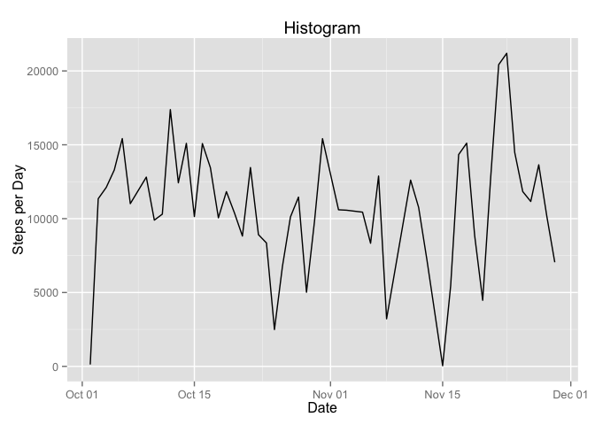
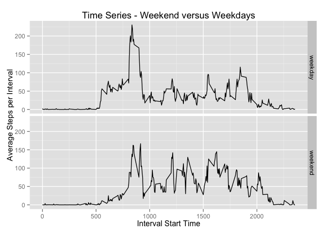
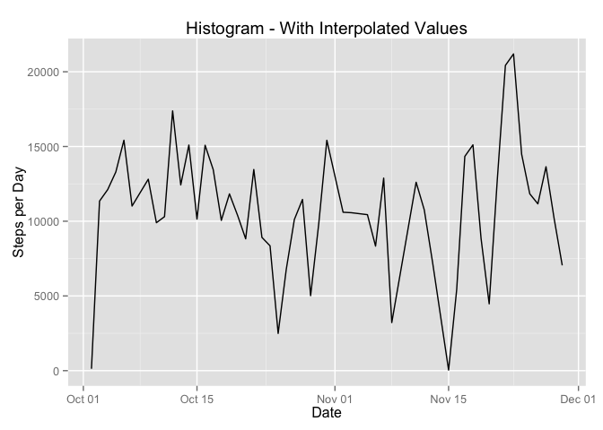

# Reproducible Research: Peer Assessment 1

This study uses activity monitoring data for analysis. See the ReadMe file for more information.

## Loading and preprocessing the data

```r
setwd("~/gitStuff/datasciencecoursera/RepData_PeerAssessment1-master")
library(dplyr)
```

```
## 
## Attaching package: 'dplyr'
```

```
## The following objects are masked from 'package:stats':
## 
##     filter, lag
```

```
## The following objects are masked from 'package:base':
## 
##     intersect, setdiff, setequal, union
```

```r
library(ggplot2)

##read the data file
df <- read.csv("activity.csv", stringsAsFactors = FALSE)
```

## What is mean total number of steps taken per day?

```r
##Mean and median number of steps per day
dfMeanbyDay <-  df %>% 
            filter(steps != "NA") %>%
            group_by(date) %>%
            summarize ( med= median(steps, na.rm=TRUE), mn = mean(steps, na.rm=TRUE) )

#Total number of steps per day
dfTotal <- df %>% 
          filter(steps != "NA") %>%
          group_by(date) %>%
          summarize(total = sum(steps, na.rm=TRUE))

#Mean steps per interval (across days)
dfMeanbyInterval <-  df %>% 
        filter(steps != "NA") %>%
        group_by(interval) %>%
        summarize (mn = mean(steps) )

#change date to type date to make the graph work correctly
dfTotal$date <- as.Date(dfTotal$date)

##make the plot of total steps per day
g1 <- ggplot(dfTotal, aes(date, total) ) + 
    geom_line() +
    labs(x="Date", y="Steps per Day") + 
    ggtitle("Histogram")
print(g1)
```




## What is the average daily activity pattern?

```r
##make the plot
g2 <- ggplot(dfMeanbyInterval, aes(interval, mn) ) + 
  geom_line() +
  labs(x="Interval Start Time", y="Average Steps per Interval") + 
  ggtitle("Time Series")
print(g2)
```


```r
#dev.off() ##close the png file device

#Which interval has the highest number of average steps?
theMax <- dfMeanbyInterval %>% summarize(max(mn))
maxVector <- dfMeanbyInterval %>% filter(as.double(mn) == as.double(theMax)) 
```
The interval (time) with the greatest average number of steps is shown below.

```r
print(maxVector)
```

```
## Source: local data frame [1 x 2]
## 
##   interval       mn
##      (int)    (dbl)
## 1      835 206.1698
```
So 8:35 am is the time of most activity.


## Imputing missing values

```r
#Calculate the number of missing values
dfMissing <- df %>% 
  filter(is.na(steps))

dfMissingCount <- summarise(dfMissing, n())

#Fill in missing values using the average for the interval but first prepare the 
#data frames
dfMissing$interval <- as.character(dfMissing$interval) 
dfMeanbyInterval$interval <- as.character(dfMeanbyInterval$interval) 


dfFilled <- left_join(dfMissing, dfMeanbyInterval) %>% transmute(date, interval, steps=mn)
```

```
## Joining by: "interval"
```

```r
#Now combine the filled data with the original data
dfNotMissing <- filter(df, !is.na(steps))
#do some type casting
  dfNotMissing$steps <- as.numeric(dfNotMissing$steps)
  dfFilled$interval <- as.integer(dfFilled$interval)

dfClean <- union(dfFilled, dfNotMissing, order_by(date) ) 


##Mean and median number of steps per day - with interpolated values
dfMeanbyDay2 <-  dfClean %>% 
  group_by(date) %>%
  summarize ( med= median(steps, na.rm=TRUE), mn = mean(steps, na.rm=TRUE) )

#Total number of steps per day - with interpolated values
dfTotal2 <- dfClean %>% 
  group_by(date) %>%
  summarize(total = sum(steps, na.rm=TRUE))

#Mean steps per interval (across days) - with interpolated values
dfMeanbyInterval2 <-  dfClean %>% 
  group_by(interval) %>%
  summarize (mn = mean(steps) )

#change date to type date to make the graph work correctly
dfTotal$date <- as.Date(dfTotal$date)

##make the plot
g1 <- ggplot(dfTotal, aes(date, total) ) + 
  geom_line() +
  labs(x="Date", y="Steps per Day") + 
  ggtitle("Histogram - With Interpolated Values")
print(g1)
```


The total number of missing values in the dataset is: 2304
The missing values will be replaced with the average value for each time period in the rest of the dataset. 

This method does not seem to affect the total values. 


## Are there differences in activity patterns between weekdays and weekends?

```r
dfDays <- dfClean
dfDays$date <- as.Date(dfDays$date)

dfDays <- dfDays  %>% mutate(dayType = ifelse(weekdays(date)=="Saturday" | weekdays(date)=="Sunday", "weekend", "weekday"))

#Mean steps per interval (across days) - with interpolated values
dfMeanbyInterval3 <-  dfDays %>% 
  group_by(interval, dayType) %>%
  summarize (mn = mean(steps) )

#plot the graphs
g3 <- ggplot(dfMeanbyInterval3, aes(interval, mn)) + 
  geom_line() +
  facet_grid(dayType~.) + 
  labs(x="Interval Start Time", y="Average Steps per Interval") + 
  ggtitle("Time Series - Weekend versus Weekdays")
print(g3)
```


Results show that there is a difference in the pattern between weekdays and weekends. This is especially apparent with the difference between the 8:35 am peak in activity on weekdays and the less consistent activity on weekends at that time. However, oveall activity seems to be greater on weekends than on weekdays. 
