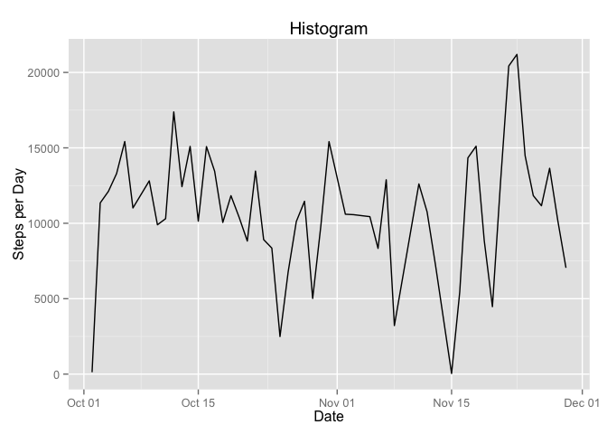
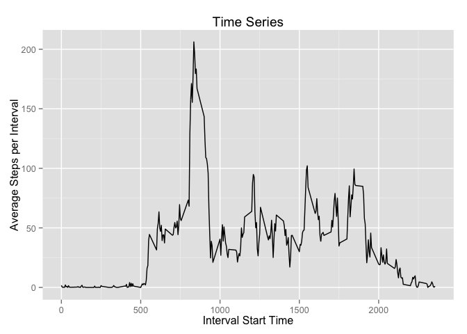

# Reproducible Research: Peer Assessment 1


## Loading and preprocessing the data

```r
setwd("~/gitStuff/datasciencecoursera/RepData_PeerAssessment1-master")
library(dplyr)
```

```
## 
## Attaching package: 'dplyr'
```

```
## The following objects are masked from 'package:stats':
## 
##     filter, lag
```

```
## The following objects are masked from 'package:base':
## 
##     intersect, setdiff, setequal, union
```

```r
##read the data file
df <- read.csv("activity.csv", stringsAsFactors = FALSE)
```


## What is mean total number of steps taken per day?

```r
##Mean and median number of steps per day
dfMeanbyDay <-  df %>% 
            filter(steps != "NA") %>%
            group_by(date) %>%
            summarize ( med= median(steps, na.rm=TRUE), mn = mean(steps, na.rm=TRUE) )

#Total number of steps per day
dfTotal <- df %>% 
          filter(steps != "NA") %>%
          group_by(date) %>%
          summarize(total = sum(steps, na.rm=TRUE))

#Mean steps per interval (across days)
dfMeanbyInterval <-  df %>% 
        filter(steps != "NA") %>%
        group_by(interval) %>%
        summarize (mn = mean(steps) )
```


## What is the average daily activity pattern?

```r
##open graphics device
#png(file = "plot1.png", width = 480, height = 480, units = "px") 
library(ggplot2)

#change date to type date to make the graph work correctly
dfTotal$date <- as.Date(dfTotal$date)

##make the plot
g1 <- ggplot(dfTotal, aes(date, total) ) + 
    geom_line() +
    labs(x="Date", y="Steps per Day") + 
    ggtitle("Histogram")
print(g1)
```



```r
##make the plot
g2 <- ggplot(dfMeanbyInterval, aes(interval, mn) ) + 
  geom_line() +
  labs(x="Interval Start Time", y="Average Steps per Interval") + 
  ggtitle("Time Series")
print(g2)
```



```r
#dev.off() ##close the png file device

#Which interval has the highest number of average steps?
theMax <- dfMeanbyInterval %>% summarize(max(mn))
maxVector <- dfMeanbyInterval %>% filter(as.double(mn) == as.double(theMax)) 
```


## Imputing missing values

```r
#Calculate the number of missing values
dfMissing <- df %>% 
  filter(is.na(steps))

dfMissingCount <- summarise(dfMissing, n())

#Fill in missing values using the average for the interval but first prepare the 
#data frames
dfMissing$interval <- as.character(dfMissing$interval) 
dfMeanbyInterval$interval <- as.character(dfMeanbyInterval$interval) 

dfFilled <- left_join(dfMissing, dfMeanbyInterval) %>% transmute(date, interval, steps=mn)
```

```
## Joining by: "interval"
```


## Are there differences in activity patterns between weekdays and weekends?


